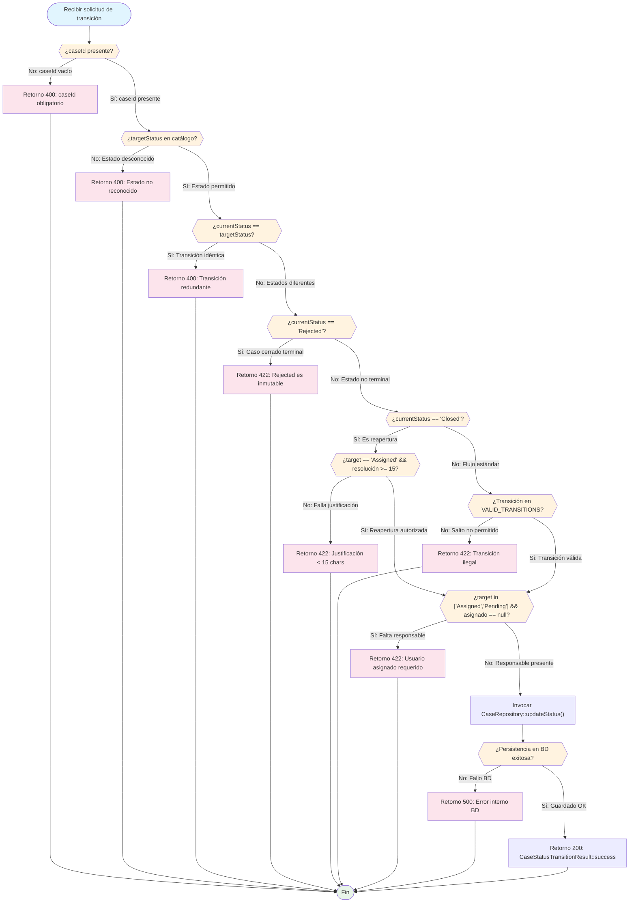

```mermaid
flowchart TD
    Start([Recibir solicitud de transición]) --> ValId{{"¿caseId presente?"}}
    ValId -- No: caseId vacío --> Err400_Id["Retorno 400: caseId obligatorio"]
    ValId -- Sí: caseId presente --> ValDestino{{"¿targetStatus en catálogo?"}}
    Err400_Id ~~~ ValDestino

    ValDestino -- No: Estado desconocido --> Err400_Destino["Retorno 400: Estado no reconocido"]
    ValDestino -- Sí: Estado permitido --> ValIdentico{{"¿currentStatus == targetStatus?"}}
    Err400_Destino ~~~ ValIdentico

    ValIdentico -- Sí: Transición idéntica --> Err400_Identico["Retorno 400: Transición redundante"]
    ValIdentico -- No: Estados diferentes --> ValRejected{{"¿currentStatus == 'Rejected'?"}}
    Err400_Identico ~~~ ValRejected

    ValRejected -- Sí: Caso cerrado terminal --> Err422_Rejected["Retorno 422: Rejected es inmutable"]
    ValRejected -- No: Estado no terminal --> ValClosed{{"¿currentStatus == 'Closed'?"}}
    Err422_Rejected ~~~ ValClosed

    ValClosed -- Sí: Es reapertura --> ValReapertura{{"¿target == 'Assigned' && resolución >= 15?"}}
    ValClosed -- No: Flujo estándar --> ValMatriz{{"¿Transición en VALID_TRANSITIONS?"}}
    ValReapertura ~~~ ValMatriz

    ValReapertura -- No: Falla justificación --> Err422_Reapertura["Retorno 422: Justificación < 15 chars"]
    ValReapertura -- Sí: Reapertura autorizada --> ValAsignado{{"¿target in ['Assigned','Pending'] && asignado == null?"}}
    Err422_Reapertura ~~~ ValAsignado

    ValMatriz -- No: Salto no permitido --> Err422_Matriz["Retorno 422: Transición ilegal"]
    ValMatriz -- Sí: Transición válida --> ValAsignado
    Err422_Matriz ~~~ ValAsignado

    ValAsignado -- Sí: Falta responsable --> Err422_Asignado["Retorno 422: Usuario asignado requerido"]
    ValAsignado -- No: Responsable presente --> Persistir["Invocar CaseRepository::updateStatus()"]
    Err422_Asignado ~~~ Persistir

    Persistir --> ValPersistencia{{"¿Persistencia en BD exitosa?"}}
    ValPersistencia -- No: Fallo BD --> Err500_BD["Retorno 500: Error interno BD"]
    ValPersistencia -- Sí: Guardado OK --> Resp200["Retorno 200: CaseStatusTransitionResult::success"]
    Err500_BD ~~~ Resp200

    Err400_Id --> End([Fin])
    Err400_Destino --> End
    Err400_Identico --> End
    Err422_Rejected --> End
    Err422_Reapertura --> End
    Err422_Matriz --> End
    Err422_Asignado --> End
    Err500_BD --> End
    Resp200 --> End

    style Start fill:#e1f5fe
    style End fill:#e8f5e9
    style ValId fill:#fff3e0
    style ValDestino fill:#fff3e0
    style ValIdentico fill:#fff3e0
    style ValRejected fill:#fff3e0
    style ValClosed fill:#fff3e0
    style ValReapertura fill:#fff3e0
    style ValMatriz fill:#fff3e0
    style ValAsignado fill:#fff3e0
    style ValPersistencia fill:#fff3e0
    style Err400_Id fill:#fce4ec
    style Err400_Destino fill:#fce4ec
    style Err400_Identico fill:#fce4ec
    style Err422_Rejected fill:#fce4ec
    style Err422_Reapertura fill:#fce4ec
    style Err422_Matriz fill:#fce4ec
    style Err422_Asignado fill:#fce4ec
    style Err500_BD fill:#fce4ec
```
