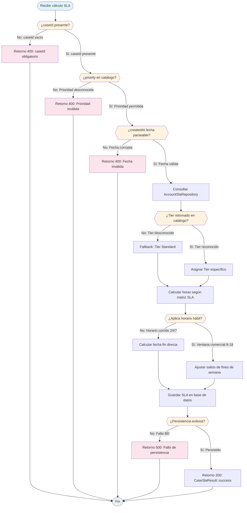

```mermaid
flowchart TD
    Start([Recibir cálculo SLA]) --> ValId{{"¿caseId presente?"}}
    ValId -- No: caseId vacío --> Err400_Id["Retorno 400: caseId obligatorio"]
    ValId -- Sí: caseId presente --> ValPriority{{"¿priority en catálogo?"}}
    Err400_Id ~~~ ValPriority

    ValPriority -- No: Prioridad desconocida --> Err400_Priority["Retorno 400: Prioridad inválida"]
    ValPriority -- Sí: Prioridad permitida --> ValFecha{{"¿createdAt fecha parseable?"}}
    Err400_Priority ~~~ ValFecha

    ValFecha -- No: Fecha corrupta --> Err400_Fecha["Retorno 400: Fecha inválida"]
    ValFecha -- Sí: Fecha válida --> ObtenerTier["Consultar AccountSlaRepository"]
    Err400_Fecha ~~~ ObtenerTier

    ObtenerTier --> ValTier{{"¿Tier retornado en catálogo?"}}
    ValTier -- No: Tier desconocido --> SetFallback["Fallback: Tier Standard"]
    ValTier -- Sí: Tier reconocido --> SetTier["Asignar Tier específico"]
    SetFallback ~~~ SetTier

    SetFallback --> CalcularHoras["Calcular horas según matriz SLA"]
    SetTier --> CalcularHoras

    CalcularHoras --> ValHorario{{"¿Aplica horario hábil?"}}
    ValHorario -- No: Horario corrido 24/7 --> CalcDirecto["Calcular fecha fin directa"]
    ValHorario -- Sí: Ventana comercial 8-18 --> CalcBusiness["Ajustar saltos de fines de semana"]
    CalcDirecto ~~~ CalcBusiness

    CalcDirecto --> PersistirSla["Guardar SLA en base de datos"]
    CalcBusiness --> PersistirSla

    PersistirSla --> ValPersist{{"¿Persistencia exitosa?"}}
    ValPersist -- No: Fallo BD --> Err500_BD["Retorno 500: Fallo de persistencia"]
    ValPersist -- Sí: Persistido --> Resp200["Retorno 200: CaseSlaResult::success"]
    Err500_BD ~~~ Resp200

    Err400_Id --> End([Fin])
    Err400_Priority --> End
    Err400_Fecha --> End
    Err500_BD --> End
    Resp200 --> End

    style Start fill:#e1f5fe
    style End fill:#e8f5e9
    style ValId fill:#fff3e0
    style ValPriority fill:#fff3e0
    style ValFecha fill:#fff3e0
    style ValTier fill:#fff3e0
    style ValHorario fill:#fff3e0
    style ValPersist fill:#fff3e0
    style Err400_Id fill:#fce4ec
    style Err400_Priority fill:#fce4ec
    style Err400_Fecha fill:#fce4ec
    style Err500_BD fill:#fce4ec
```
