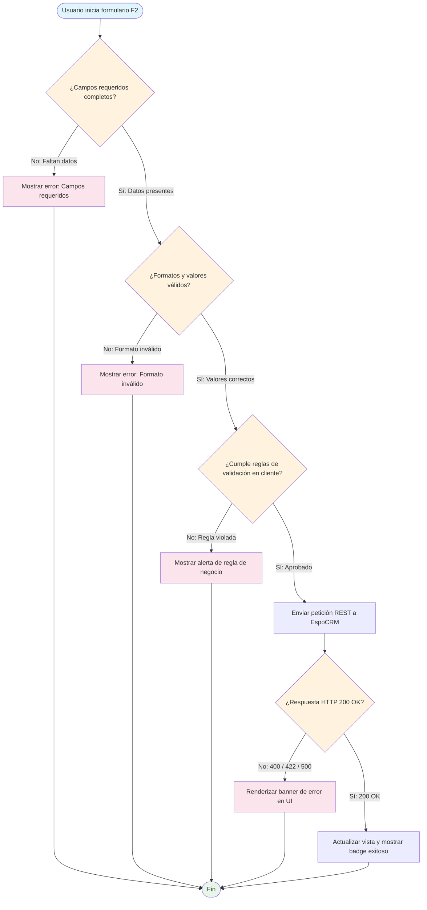

```mermaid
flowchart TD
    Start([Usuario inicia formulario F2]) --> ValCampos{"¿Campos requeridos completos?"}
    ValCampos -- No: Faltan datos --> ErrReq["Mostrar error: Campos requeridos"]
    ValCampos -- Sí: Datos presentes --> ValFormato{"¿Formatos y valores válidos?"}
    ErrReq ~~~ ValFormato

    ValFormato -- No: Formato inválido --> ErrFmt["Mostrar error: Formato inválido"]
    ValFormato -- Sí: Valores correctos --> ValReglaNeg{"¿Cumple reglas de validación en cliente?"}
    ErrFmt ~~~ ValReglaNeg

    ValReglaNeg -- No: Regla violada --> ErrRegla["Mostrar alerta de regla de negocio"]
    ValReglaNeg -- Sí: Aprobado --> CallAPI["Enviar petición REST a EspoCRM"]
    ErrRegla ~~~ CallAPI

    CallAPI --> RespAPI{"¿Respuesta HTTP 200 OK?"}
    RespAPI -- No: 400 / 422 / 500 --> RenderErr["Renderizar banner de error en UI"]
    RespAPI -- Sí: 200 OK --> RenderOK["Actualizar vista y mostrar badge exitoso"]
    RenderErr ~~~ RenderOK

    ErrReq --> End([Fin])
    ErrFmt --> End
    ErrRegla --> End
    RenderErr --> End
    RenderOK --> End

    style Start fill:#e1f5fe
    style End fill:#e8f5e9
    style ValCampos fill:#fff3e0
    style ValFormato fill:#fff3e0
    style ValReglaNeg fill:#fff3e0
    style RespAPI fill:#fff3e0
    style ErrReq fill:#fce4ec
    style ErrFmt fill:#fce4ec
    style ErrRegla fill:#fce4ec
    style RenderErr fill:#fce4ec
```
