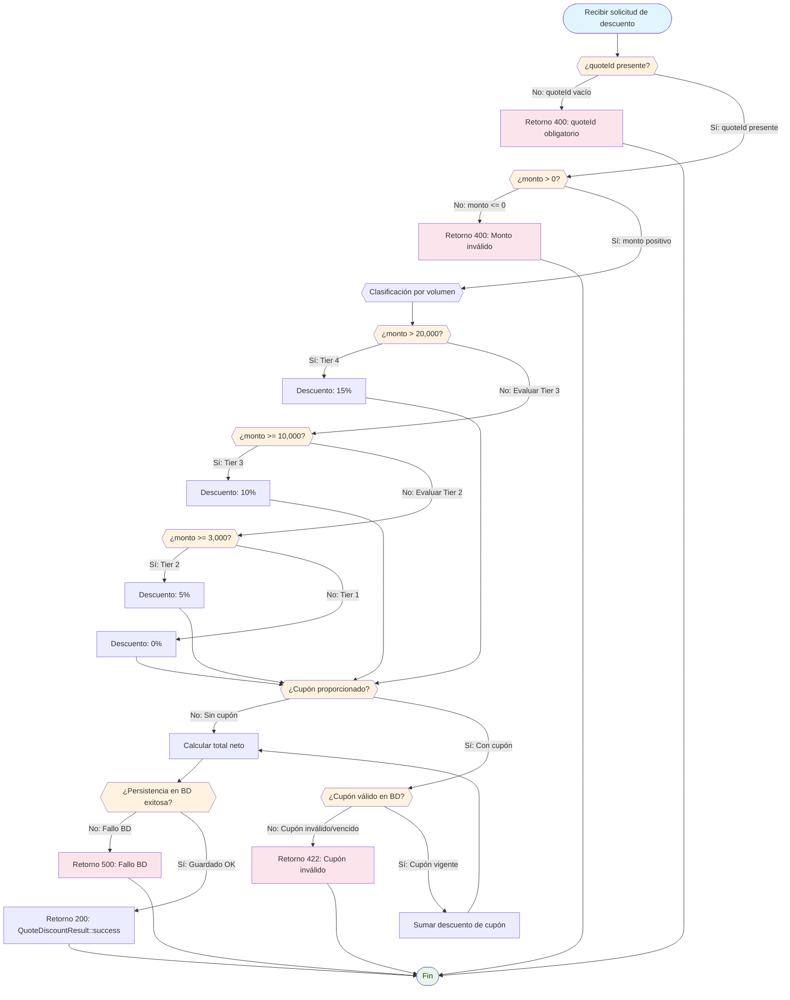

```mermaid
flowchart TD
    Start([Recibir solicitud de descuento]) --> ValId{{"¿quoteId presente?"}}
    ValId -- No: quoteId vacío --> Err400_Id["Retorno 400: quoteId obligatorio"]
    ValId -- Sí: quoteId presente --> ValMonto{{"¿monto > 0?"}}
    Err400_Id ~~~ ValMonto

    ValMonto -- No: monto <= 0 --> Err400_Monto["Retorno 400: Monto inválido"]
    ValMonto -- Sí: monto positivo --> ClasificarTier{{"Clasificación por volumen"}}
    Err400_Monto ~~~ ClasificarTier

    ClasificarTier --> Tier4{{"¿monto > 20,000?"}}
    Tier4 -- Sí: Tier 4 --> SetDesc15["Descuento: 15%"]
    Tier4 -- No: Evaluar Tier 3 --> Tier3{{"¿monto >= 10,000?"}}
    SetDesc15 ~~~ Tier3

    Tier3 -- Sí: Tier 3 --> SetDesc10["Descuento: 10%"]
    Tier3 -- No: Evaluar Tier 2 --> Tier2{{"¿monto >= 3,000?"}}
    SetDesc10 ~~~ Tier2

    Tier2 -- Sí: Tier 2 --> SetDesc5["Descuento: 5%"]
    Tier2 -- No: Tier 1 --> SetDesc0["Descuento: 0%"]
    SetDesc5 ~~~ SetDesc0

    SetDesc15 --> ValCupon{{"¿Cupón proporcionado?"}}
    SetDesc10 --> ValCupon
    SetDesc5 --> ValCupon
    SetDesc0 --> ValCupon

    ValCupon -- No: Sin cupón --> CalcularTotal["Calcular total neto"]
    ValCupon -- Sí: Con cupón --> ValidarCupon{{"¿Cupón válido en BD?"}}
    CalcularTotal ~~~ ValidarCupon

    ValidarCupon -- No: Cupón inválido/vencido --> Err422_Cupon["Retorno 422: Cupón inválido"]
    ValidarCupon -- Sí: Cupón vigente --> AplicarCupon["Sumar descuento de cupón"]
    Err422_Cupon ~~~ AplicarCupon

    AplicarCupon --> CalcularTotal
    CalcularTotal --> PersistirCotiz{{"¿Persistencia en BD exitosa?"}}

    PersistirCotiz -- No: Fallo BD --> Err500_BD["Retorno 500: Fallo BD"]
    PersistirCotiz -- Sí: Guardado OK --> Resp200["Retorno 200: QuoteDiscountResult::success"]
    Err500_BD ~~~ Resp200

    Err400_Id --> End([Fin])
    Err400_Monto --> End
    Err422_Cupon --> End
    Err500_BD --> End
    Resp200 --> End

    style Start fill:#e1f5fe
    style End fill:#e8f5e9
    style ValId fill:#fff3e0
    style ValMonto fill:#fff3e0
    style Tier4 fill:#fff3e0
    style Tier3 fill:#fff3e0
    style Tier2 fill:#fff3e0
    style ValCupon fill:#fff3e0
    style ValidarCupon fill:#fff3e0
    style PersistirCotiz fill:#fff3e0
    style Err400_Id fill:#fce4ec
    style Err400_Monto fill:#fce4ec
    style Err422_Cupon fill:#fce4ec
    style Err500_BD fill:#fce4ec
```
