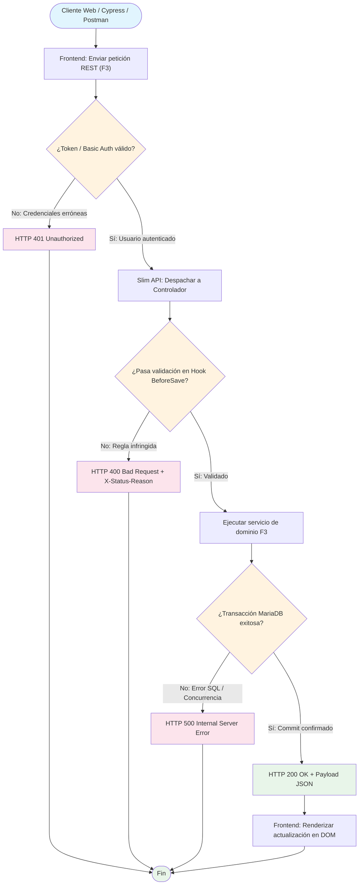

```mermaid
flowchart TD
    Start([Cliente Web / Cypress / Postman]) --> FE_Action["Frontend: Enviar petición REST (F3)"]
    FE_Action --> AuthMiddleware{"¿Token / Basic Auth válido?"}
    AuthMiddleware -- No: Credenciales erróneas --> Err401["HTTP 401 Unauthorized"]
    AuthMiddleware -- Sí: Usuario autenticado --> RouteDispatcher["Slim API: Despachar a Controlador"]
    Err401 ~~~ RouteDispatcher

    RouteDispatcher --> HookValidation{"¿Pasa validación en Hook BeforeSave?"}
    HookValidation -- No: Regla infringida --> Err400_Hook["HTTP 400 Bad Request + X-Status-Reason"]
    HookValidation -- Sí: Validado --> DomainService["Ejecutar servicio de dominio F3"]
    Err400_Hook ~~~ DomainService

    DomainService --> DbTransaction{"¿Transacción MariaDB exitosa?"}
    DbTransaction -- No: Error SQL / Concurrencia --> Err500_DB["HTTP 500 Internal Server Error"]
    DbTransaction -- Sí: Commit confirmado --> Resp200_JSON["HTTP 200 OK + Payload JSON"]
    Err500_DB ~~~ Resp200_JSON

    Resp200_JSON --> ClientRender["Frontend: Renderizar actualización en DOM"]
    Err401 --> End([Fin])
    Err400_Hook --> End
    Err500_DB --> End
    ClientRender --> End

    style Start fill:#e1f5fe
    style End fill:#e8f5e9
    style AuthMiddleware fill:#fff3e0
    style HookValidation fill:#fff3e0
    style DbTransaction fill:#fff3e0
    style Err401 fill:#fce4ec
    style Err400_Hook fill:#fce4ec
    style Err500_DB fill:#fce4ec
    style Resp200_JSON fill:#e8f5e9
```
