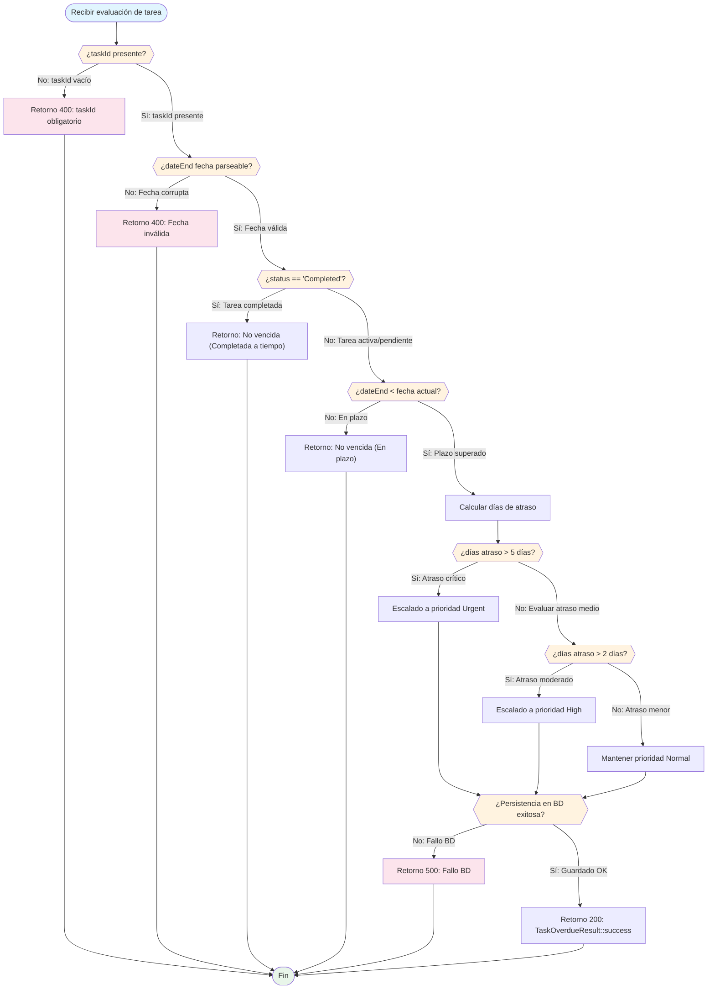

```mermaid
flowchart TD
    Start([Recibir evaluación de tarea]) --> ValId{{"¿taskId presente?"}}
    ValId -- No: taskId vacío --> Err400_Id["Retorno 400: taskId obligatorio"]
    ValId -- Sí: taskId presente --> ValFecha{{"¿dateEnd fecha parseable?"}}
    Err400_Id ~~~ ValFecha

    ValFecha -- No: Fecha corrupta --> Err400_Fecha["Retorno 400: Fecha inválida"]
    ValFecha -- Sí: Fecha válida --> ValCompletada{{"¿status == 'Completed'?"}}
    Err400_Fecha ~~~ ValCompletada

    ValCompletada -- Sí: Tarea completada --> RetCompleted["Retorno: No vencida (Completada a tiempo)"]
    ValCompletada -- No: Tarea activa/pendiente --> ValVencimiento{{"¿dateEnd < fecha actual?"}}
    RetCompleted ~~~ ValVencimiento

    ValVencimiento -- No: En plazo --> RetEnPlazo["Retorno: No vencida (En plazo)"]
    ValVencimiento -- Sí: Plazo superado --> CalcularDias["Calcular días de atraso"]
    RetEnPlazo ~~~ CalcularDias

    CalcularDias --> ValDiasCriticos{{"¿días atraso > 5 días?"}}
    ValDiasCriticos -- Sí: Atraso crítico --> SetEscaladoUrgente["Escalado a prioridad Urgent"]
    ValDiasCriticos -- No: Evaluar atraso medio --> ValDiasMedios{{"¿días atraso > 2 días?"}}
    SetEscaladoUrgente ~~~ ValDiasMedios

    ValDiasMedios -- Sí: Atraso moderado --> SetEscaladoAlto["Escalado a prioridad High"]
    ValDiasMedios -- No: Atraso menor --> SetPrioridadNormal["Mantener prioridad Normal"]
    SetEscaladoAlto ~~~ SetPrioridadNormal

    SetEscaladoUrgente --> PersistirTarea{{"¿Persistencia en BD exitosa?"}}
    SetEscaladoAlto --> PersistirTarea
    SetPrioridadNormal --> PersistirTarea

    PersistirTarea -- No: Fallo BD --> Err500_BD["Retorno 500: Fallo BD"]
    PersistirTarea -- Sí: Guardado OK --> Resp200["Retorno 200: TaskOverdueResult::success"]
    Err500_BD ~~~ Resp200

    Err400_Id --> End([Fin])
    Err400_Fecha --> End
    RetCompleted --> End
    RetEnPlazo --> End
    Err500_BD --> End
    Resp200 --> End

    style Start fill:#e1f5fe
    style End fill:#e8f5e9
    style ValId fill:#fff3e0
    style ValFecha fill:#fff3e0
    style ValCompletada fill:#fff3e0
    style ValVencimiento fill:#fff3e0
    style ValDiasCriticos fill:#fff3e0
    style ValDiasMedios fill:#fff3e0
    style PersistirTarea fill:#fff3e0
    style Err400_Id fill:#fce4ec
    style Err400_Fecha fill:#fce4ec
    style Err500_BD fill:#fce4ec
```
