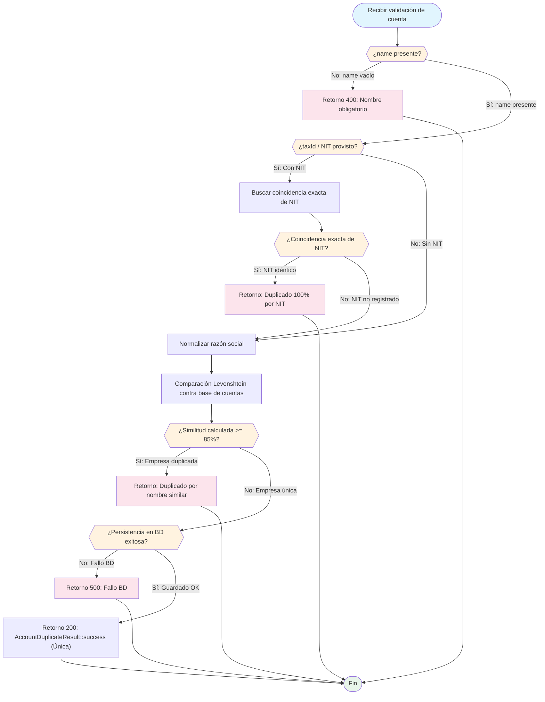

```mermaid
flowchart TD
    Start([Recibir validación de cuenta]) --> ValName{{"¿name presente?"}}
    ValName -- No: name vacío --> Err400_Name["Retorno 400: Nombre obligatorio"]
    ValName -- Sí: name presente --> ValTaxId{{"¿taxId / NIT provisto?"}}
    Err400_Name ~~~ ValTaxId

    ValTaxId -- Sí: Con NIT --> BuscarNIT["Buscar coincidencia exacta de NIT"]
    ValTaxId -- No: Sin NIT --> NormalizarRazon["Normalizar razón social"]
    BuscarNIT ~~~ NormalizarRazon

    BuscarNIT --> MatchNIT{{"¿Coincidencia exacta de NIT?"}}
    MatchNIT -- Sí: NIT idéntico --> RetDuplicadoNIT["Retorno: Duplicado 100% por NIT"]
    MatchNIT -- No: NIT no registrado --> NormalizarRazon
    RetDuplicadoNIT ~~~ NormalizarRazon

    NormalizarRazon --> BuscarSimilitud["Comparación Levenshtein contra base de cuentas"]
    BuscarSimilitud --> ValSimilitud{{"¿Similitud calculada >= 85%?"}}

    ValSimilitud -- Sí: Empresa duplicada --> RetDuplicadoNombre["Retorno: Duplicado por nombre similar"]
    ValSimilitud -- No: Empresa única --> PersistirCuenta{{"¿Persistencia en BD exitosa?"}}
    RetDuplicadoNombre ~~~ PersistirCuenta

    PersistirCuenta -- No: Fallo BD --> Err500_BD["Retorno 500: Fallo BD"]
    PersistirCuenta -- Sí: Guardado OK --> Resp200["Retorno 200: AccountDuplicateResult::success (Única)"]
    Err500_BD ~~~ Resp200

    Err400_Name --> End([Fin])
    RetDuplicadoNIT --> End
    RetDuplicadoNombre --> End
    Err500_BD --> End
    Resp200 --> End

    style Start fill:#e1f5fe
    style End fill:#e8f5e9
    style ValName fill:#fff3e0
    style ValTaxId fill:#fff3e0
    style MatchNIT fill:#fff3e0
    style ValSimilitud fill:#fff3e0
    style PersistirCuenta fill:#fff3e0
    style Err400_Name fill:#fce4ec
    style RetDuplicadoNIT fill:#fce4ec
    style RetDuplicadoNombre fill:#fce4ec
    style Err500_BD fill:#fce4ec
```
